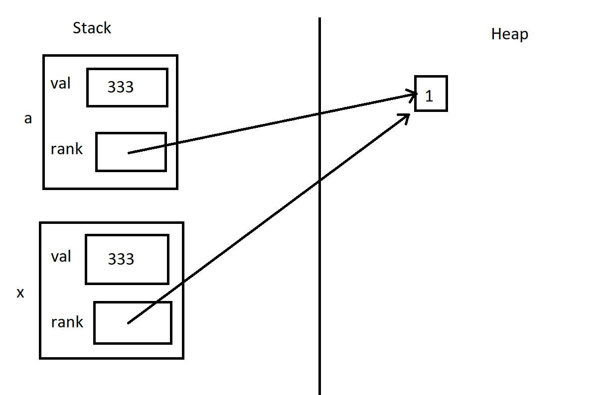

# Copy Constructor

Contributors: Edward Zhang

---
## Introduction

Let's talk about copy constructors! If you're coming from Java, this might be one of the biggest changes

C++ has the notion of a copy constructor, abbreviated `cctor`

The cctor is a special type of constructor that creates a new object as a copy of some existing object

It's important to remember that in C/C++, almost everything is passed by value. This means that for better or worse, the cctor is quite frequently invoked, sometimes when you might not expect it.

---

## cctor implementation

For the rest of this chapter, let's use the following `Node` class as an example

```C++
class Node{
public:
  int val;

  Node();
  Node(int val);
  Node(const Node& other); // This is the copy constructor
};
```
- The class has one public data member, `int val`

General syntax for copy constructor:
```
className(const className& other){
  // make a copy of each data member
}
```

We can see that the first parameter of a cctor is a REFERENCE to some existing object of the same type
- ... why must it be a reference? We'll come back to this near the end of the chapter

<br>

Here is what one implementation of the cctor could look like:
```C++
Node::Node(const Node& other){
  val = other.val;
}
```

The code is very straightforward! As its name implies, we simply construct a new object by making copies (whatever that means to you) of some existing object's data members

---
The next few sections will examine when the copy constructor is invoked. There are 3 main cases

---
## cctor invocation case #1

The cctor is invoked when you try to initialize an object from another object of the same type

There are 2 ways to do this: direct initialization or copy initialization

```C++
Node a(333);

Node b(a); // direct initialization

Node c = a; // copy initialization
```
- The last line (`Node c = a`) may have surprised you. In Java, this would mean setting variable `c` to refer to existing `Node` object `a`
- In C++ however, this invokes the copy constructor. We'll see an example shortly that should clear up any confusion

<br>

<details>
<summary>Direct initialization vs copy initialization</summary>
<br>

Direct initialization: we ask the compiler to use function matching to figure out which constructor best matches the provided argument

For example:
```C++
// Compiler will look to see which constructor takes a single
// int argument -> Node(int val)
Node a(333);

// Compiler will look to see which constructor takes
// an argument of type Node -> Node(const Node& other), the cctor!
Node b(a);
```

<br>

Copy initialization: we ask the compiler to copy the right-hand operand into the object being created
- This will happen if you initialize variables using `=`

```C++
// Compiler knows to construct object "c" as a COPY of existing
// object "a"
Node c = a;
```

> NOTE: you may be wondering what would happen if we split the above steps:
```C++
Node c; // default constructor - direct initialization
c = a; // copy-assignment
```
- The cctor is NOT called here. In another chapter we will look at the copy-assignment operator
- The copy-assignment operator does almost the same thing as a cctor, but just remember that by splitting the steps, you do not call the cctor

</details>

---
## Differences from Java

Remember in Java, if we did something like:
```java
Node a = new Node(333);
Node c = a;

c.val = 124;
System.out.println(a.val); // what gets printed?
```
- If we wrote this in Java, `c` is a reference to object `a`
- Thus, changing `c`'s fields would also be reflected in `a`. In the above example, we would print `124`


In C++:
```C++
Node a(333);
Node c = a; // cctor invoked

c.val = 124;
std::cout << a.val << std::endl; // what is printed now?
```
- `c` is NOT a reference to `a`. Instead, it is a brand new object made as a COPY of `a` (look back to the [cctor implementation](#cctor-implementation))
- Thus, changing `c`'s fields has no impact at all on `a`
- In the above example, we will still print `333`


---
## cctor invocation case #2

Copy initialization also happens when you pass an object as an argument to a parameter of nonreference type
- whew, that's a mouthful! Look at the example below for clarity

```C++
void foo(Node x){
  std::cout << x.val << std::endl; // prints 333
  x.val = 124;
}

int main(){
  Node a(333);
  foo(a);
  std::cout << a.val << std::endl; // still prints 333
}
```
- We pass in `a` to function `foo`, but notice how the parameter `x` is a nonreference. Thus, manipulating `x`'s fields in `foo` has absolutely no effect on `a` back in `main`
- But how did `x` get `a`'s value of `333`? Copy initialization!
- I.e., `x` was copy constructed from `a` for use in the function `foo`

<details>
<summary>Looking back at cctor code</summary>

<br>

Take a look again at the cctor declaration:
```C++
Node(const Node& other);
```

My question is, why must parameter `other` be a REFERENCE to some existing Node? What if the declaration were:
```C++
Node(const Node other);
```

Answer: if `other` were a nonreference parameter, `other` would be copy constructed from the argument. But that's what we're trying to define!
- Basically the cctor would need to call the cctor, leading to a weird infinite loop

</details>

---
## cctor invocation case #3

Finally, the cctor is invoked when you try to return a non-reference object value from a function

```C++
Node foo(){
  Node x(124);
  return x;
  // Returns an unnamed temporary copy of Node "x"
  // to the call site
}

int main(){
  // Technically the cctor is invoked twice in this program
  // The resulting value of foo() is returned as a copy
  // Then we construct "a" as a copy of foo()'s result
  Node a = foo();
}

```

---
## The compiler is allowed to optimize

Note that the compiler is allowed to optimize during copy initialization and use move semantics to eliminate unecessary copies
- This is why you may write programs and sometimes not see the cctor get invoked when you might expect it

---
## Synthesized copy constructor

This is important: if you do not define your own cctor, C++ will synthesize one for you

Specifically, the synthesized cctor will perform a **shallow copy** of all your class's data members
- ... this could be dangerous, as we'll see shortly

For example, let's make some updates to our `Node` class:

```C++
class Node{
public:
  int *rank;
  int val;

  Node(int val, int rank){
    this->val = val;
    this->rank = new int(rank);
  }
  // Node(const Node& other);
};
```
- We now have an extra data member `rank`, which has type `int*`
- Let's assume `rank` is a pointer to an `int` allocated on the heap
- We also got rid of our own cctor

<br>

So now what, since we didn't define our own cctor? The synthesized cctor C++ makes for you would look something like this:
```C++
Node::Node(const Node& other){
  rank = other.rank;
  val = other.val;
}
```
- Shallow copy means that all data members would essentially be initialized like this: `dataMemberName = other.dataMemberName;`
- In the above example, look especially carefully at how we shallow copied the int pointer. See any potential problems?


---
## Danger of synthesized cctor

Let's assume that once an object falls out of scope, it will magically call `delete` or `delete[]` on any data members that are pointers to heap-allocated memory.
- See the chapter on destructors

In our `Node` class (second version), we assumed that `rank` is indeed a pointer to an `int` object on the heap

We also assumed the compiler was kind enough to supply us with the synthesized cctor, since we didn't define our own.

So anything wrong with this code?
```C++
int main(){
  Node a(333, 1); // rank 1 since 333 is the best

  Node x(a); // ok, x is a copy of a
  // we're done right?
  // ...
}
```

Sorry bad news, we just caused a double free
- By the way, a double free technically causes undefined behavior. Best case, your program crashes

How? Well, let's examine how the synthesized cctor actually copy constructed `x`
- Exercise for you: draw a memory diagram!


- Notice how a "shallow copy" of a pointer just makes the `rank` member of `a` and `x` point to the same object in the heap!
- Then when `x` falls out of scope, some magical apparatus will call `delete` on `x.rank`
- But when `a` falls out of scope, the magical apparatus will attempt to call `delete` on `a.rank`, which has already been freed!

---
## Fixing the synthesized cctor bug

To fix the bug in the last section, we just have to define our own copy constructor

We probably didn't want to copy the pointer value (i.e., an address). More likely we just wanted to copy the pointed-to object's value

So let's write our cctor:
```C++
Node::Node(const Node& other){
  val = other.val;
  rank = new int(*other.rank);
}
```