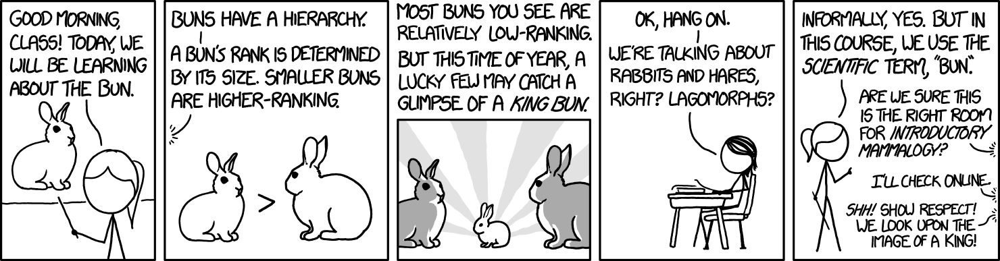
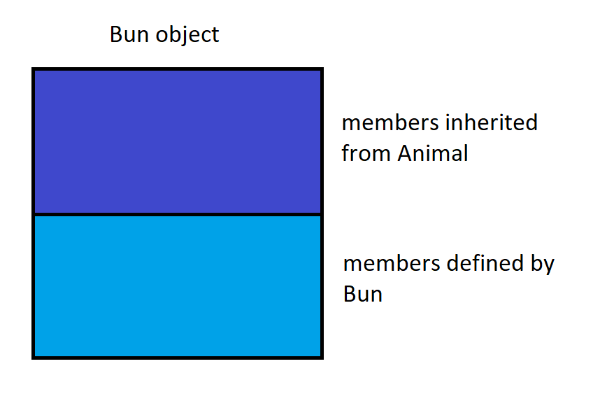

# Inheritance, Part 1

Contributors: Edward Zhang

---

Buckle up for inheritance! This multi-part series will cover many of the intricacies of inheritance in C++

Structure for this series:
1. First, let's build some intuition for what inheritance is, why we might want it, and some key inheritance/OOP concepts
2. Next we'll look at function calls in the context of inheritance. I.e., when we invoke a function call, what function is actually executed?
3. Finally, we'll examine the fine details of implementing inheritance in C++

---

## What is inheritance?

Inheritance is a fundamental idea in OOP. Using it, we can elegantly capture parent-child relationships between classes

What is a parent-child relationship? I like to think about it as an "is-a" relationship. Specifically, a child "is a" type of its parent, typically more specialized

Examples:
- A Tesla "is a" Car
- A Husky "is a" Dog
- LOST "is a" StarTracker
- [Korosensei](https://ansatsukyoshitsu.fandom.com/wiki/Korosensei) "is a" Teacher

<br>

In C++, we call a parent class the **base class**, and a child class the **derived class**

---
## Why would we want inheritance?

There are quite a few benefits that arise from using inheritance when appropriate:
- **Polymorphism**: children can redefine existing behavior while preserving the interface
    - Example: all 2D shapes have area. A circle is a shape, but we redefine its area to be $\pi r^2$
- Code reuse: children can automatically inherit functionality from their parents without having to rewrite the same code over and over
    - Example: pretend that all Animals can say "Hi". Then there's no point in rewriting this code for every derived class of `Animal`
- Extensibility: children can specify / add new behavior
    - Example: a Korosensei is a teacher, but can also fly at Mach 20


---
## Setup

Throughout this series on inheritance, let's use the following class hierarchy, appropriately based on rabbit hierarchy in this excellent [xkcd series](https://xkcd.com/1682/)
- By the way, [wild rabbit hierarchy](http://www.bunnyhugga.com/a-to-z/rabbit-behaviour/rabbit-hierarchy.html) is well documented and surprisingly detailed


> Title text: If a wild bun is sighted, a nice gesture of respect is to send a 'BUN ALERT' message to friends and family, with photographs documenting the bun's location and rank. If no photographs are possible, emoji may be substituted.

<br>

So, we can come up with our class hierarchy as such:

Class `Bun` derives from base class `Animal`

Class `KingBun` derives from class `Bun`

<br>

Code for these classes will be shown later


---
## Setup code

Let's write out some very basic code for our example classes: `Animal`, `Bun`, and `KingBun`

We will build the code step by step in the following sections and chapters


```C++
class Animal{
public:

    // Say "Hi!"
    void Speak(){
        std::cout << "Hi!" << std::endl;
    }

    virtual int Rank(){
        return 1;
    }
};

class Bun : public Animal{
public:

    virtual int Rank(){
        return 5;
    }

};

class KingBun : public Bun{
public:

    virtual int Rank(){
        return 10;
    }
};
```

---
## Code details

I want to point out a few details in the code above

A derived class must specify the base class it wishes to inherit from. A derived class specifies its parent(s) in the **class derivation list**

General syntax:
```
class childClassName : public parentClassName {...};
```
- Thus, `childClassName` inherits from base class `parentClassName`

We are making some assumptions that will be addressed later, namely:
- Assume that the access specifier for the base class is `public`
- In C++, derived classes are allowed to directly inherit from multiple base classes, called multiple inheritance. For now, assume single inheritance

<br>

Next, notice that some functions are marked `virtual` while some are not. This distinction is super important, we will examine this closely in the next chapter

---

## Example: motivation for polymorphism

As programmers, we're rightfully reluctant to write redundant code

Say we wanted to write a function that printed out an animal's rank. We could implement something like this:

```C++
void printRank(Animal a){
    std::cout << a.Rank() << std::endl;
}

void printRank(Bun b){
    std::cout << b.Rank() << std::endl;
}

void printRank(KingBun kb){
    std::cout << kb.Rank() << std::endl;
}

// etc... for all derived class of Animal

```
- Basically we're abusing function overloading

This isn't great - you can see that code is repeated a lot. This would be super tedious and unmanageable once you started making more derived classes of `Animal`

<br>

Wouldn't it be nice if we could write ONE version of `printRank()` that can process objects of either type `Animal`, `Bun`, `KingBun`, and any other derived classes of `Animal`?

Let's do that here:
```C++
void printRank(Animal &ani){
    std::cout << ani.Rank() << std::endl;
}
```
What did we change?
- We just made the parameter `ani` a reference to our desired base class (in this case `Animal`)
- We didn't change this, but notice that the function `Rank()` is `virtual`
- We will learn how exactly this works later. For now, it's sufficient to know that a solution to our redundancy problem exists

Now, we can call the function like this:
```C++
int main(){
    Animal a;
    Bun b;
    KingBun kb;
    printRank(a); // prints 1
    printRank(b); // prints 5
    printRank(kb); // prints 10
}

```
- Yay, code reuse! This is a lot cleaner and satisfies our needs

---
## Derived-to-base conversions

Before we move on, let's first address some important intuition behind inheritance:

> We can use an object of a derived type as if it were an object of its base type
- Also called derived-to-base conversion

<br>

Let me give an intuitive explanation for why we can perform derived-to-base conversion.

Think of a derived object as containing multiple parts
1. A subobject contaiing data members inherited from its base class
2. A subobject containing the members defined in the derived class

Example:



Since a derived object contains a subpart corresponding to its base class, we can safely use an object of a derived type as if it were an object of its base type
- Conceptual example: if you needed a Car to drive somewhere, a Tesla would do just fine. Sure, it contains extra functionality specific to a Tesla, but it also has all the properties of a driveable car

---
## Implications of derived-to-base conversions

Derived-to-base conversion gives us 2 important facts:

> First, we can bind a pointer/reference (to a base-class type) to an object of a type derived from that base class

This is why, in the previous chapter, we could do something like this:

```C++
void printRank(Animal &ani){
    std::cout << ani.Rank() << std::endl;
}

int main(){
    Animal a;
    Bun b;
    KingBun kb;
    printRank(a); // prints 1
    printRank(b); // prints 5
    printRank(kb); // prints 10
}
```
- Since `Bun` and `KingBun` are all derived classes of `Animal`, we can bind a reference (to `Animal`) to an object of type `Bun` or `KingBun`

<br>

Secondly, since we can do this type of binding, when we use a reference or pointer to a base-class type, we don't know the actual type of the object to which the pointer/reference is bound!
- The object can be an object of the base class or one of its derived classes
- In the example above, is `ani` bound to an `Animal`, `Bun`, or `KingBun` object? We don't know until runtime!

---
## Static type vs. Dynamic type

The **static type** of an expression is always known at compile time
- It is the type with which a variable is declared or that an expression yields

For example, in our `printRank` function, parameter `ani` has static type `Animal&`

<br>

The **dynamic type** is the type of the object in memory that the variable or expression actually represents

The dynamic type of an variable that isn't a reference or pointer is just the same as the variable's static type

Example:
```C++
Bun b;
```
- Variable `b`'s static type is `Bun`, its dynamic type is also `Bun`
- Another way to put it: a variable of type `Bun` is always a `Bun` object

> However, for a pointer or reference, the dynamic type depends on the type of argument to which the pointer/reference is bound

Example:
```C++
void printRank(Animal &ani){
    // ani's static type is Animal&
    std::cout << ani.Rank() << std::endl;
}

int main(){
    Animal a;
    Bun b;
    KingBun kb;
    printRank(a); // ani's dynamic type is Animal
    printRank(b); // ani's dynamic type is Bun
    printRank(kb); // ani's dynamic type is KingBun
}

```

---
## Base to derived conversion?

You might be wondering: in C++, are we allowed to convert from a base class object to a derived class object?

Technically yes, you can try using virtual destructors and `std::dynamic_cast` to perform a safe conversion

Generally though, this isn't safe. Think back to our section on [subobjects](#derived-to-base-conversions). Most of the time, there is no guarantee that a base class object contains the members defined by the derived class.
- Conceptual example: Say you needed the help of [Korosensei](https://ansatsukyoshitsu.fandom.com/wiki/Korosensei), an excellent teacher who can also fly at top speeds of Mach 20. Since I can't guarantee that any random teacher can also fly, I'm not allowed to perform a conversion

Thus, there is no implicit conversion from base to derived
```C++
Animal a;
Bun* bunPtr = &a;  // compile error, cannot convert base to derived
Bun& bunRef = a; // compile error

```


---
## Polymorphism

The key concept behind this entire chapter is polymorphism

Through polymorphism, a single entity (e.g., a variable, function, or object), can have multiple forms. Most importantly, this allows us to treat objects, which may be of different types, in the same exact way
- A whole host of benefits arises from using polymorphism: less redundancy, more understandable/modifiable code, etc.

We used this concept to great effect in the previous example. Instead of writing the same function for each object of base type `Animal`, we wrote code that allows us to treat all objects of type `Animal` or one of its derived classes in the same exact way!

---
## Types of polymorphism

There are 2 main types of polymorphism: static polymorphism and dynamic polymorphism

You've probably seen a lot of **static polymorphism**, also called **compile-time polymorphism**. This is just regular function overloading!
- When multiple functions have the same name but different signatures, the compiler will pick which one to call based on the arguments passed
- This happens at compile-time

<br>

**Dynamic polymorphism**, also called **runtime polymorphism**, is what happened in the earlier `printRank` example. Sometimes, for reasons we will examine in the next chapter, the compiler doesn't know which version of a function to call until runtime

Here's another way to put it: sometimes, the correct function to call can only be determined at runtime, depending on the actual type of object that the function is called on
- When we called `printRank()` in `main()`, notice how we were able to pass (as an argument) an object of either type `Animal`, `Bun`, or `KingBun`
- In `printRank()`, we invoke the virtual function `Rank()` on parameter `ani`
- Now, which class's `Rank()` function do we call? It depends on the actual type of object being passed in for `ani`!
- This step can only happen at runtime - our compiler does not know what the actual type of `ani` is until we start running the program and calling the function with arguments


---
Whew! That was a lot of conceptual material. Let's now [move on to the next chapter](inheritance-2.md) and examine function calls in more detail