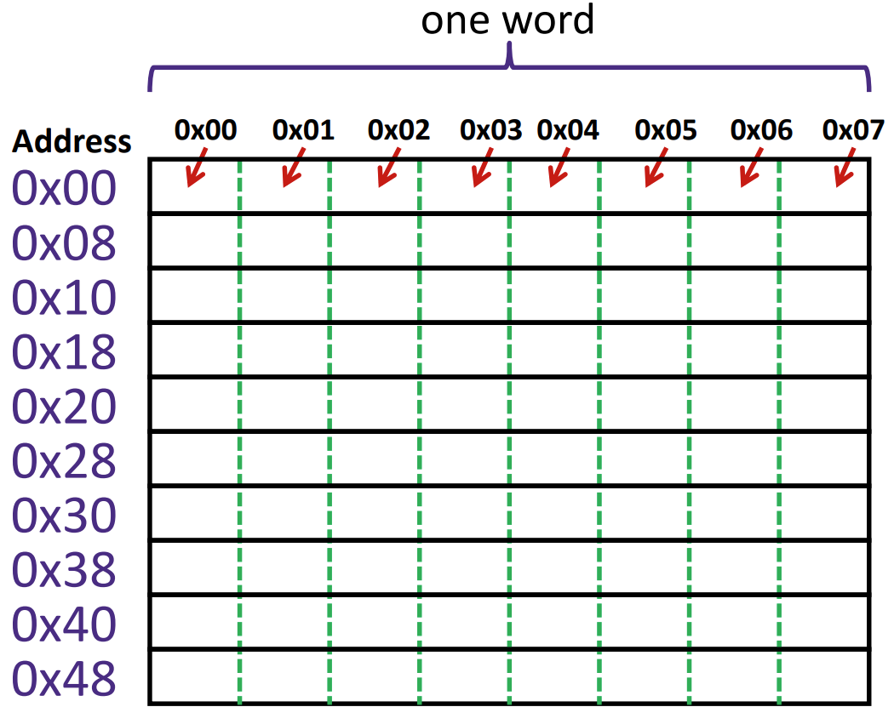
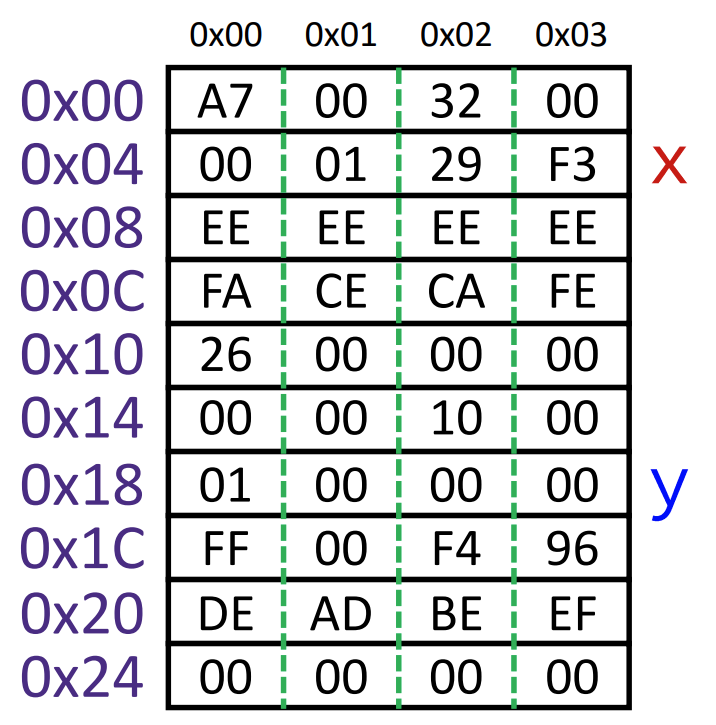
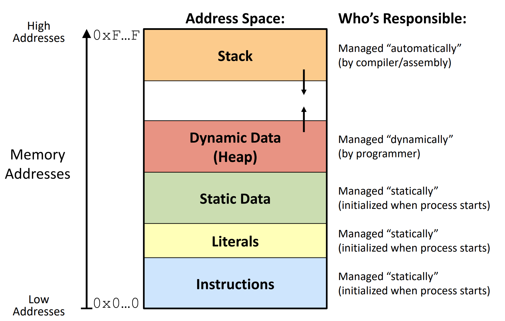
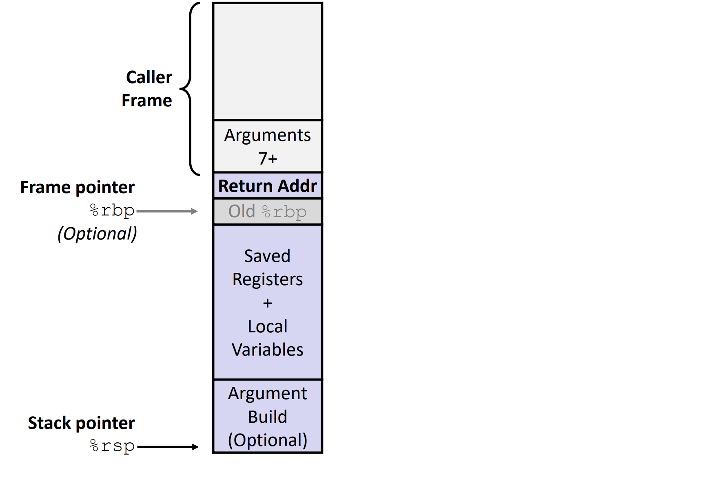
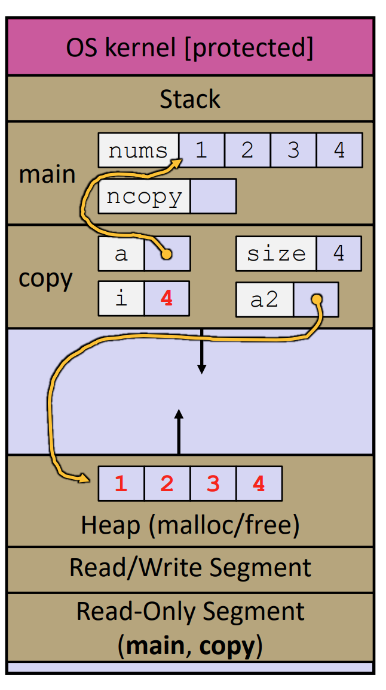
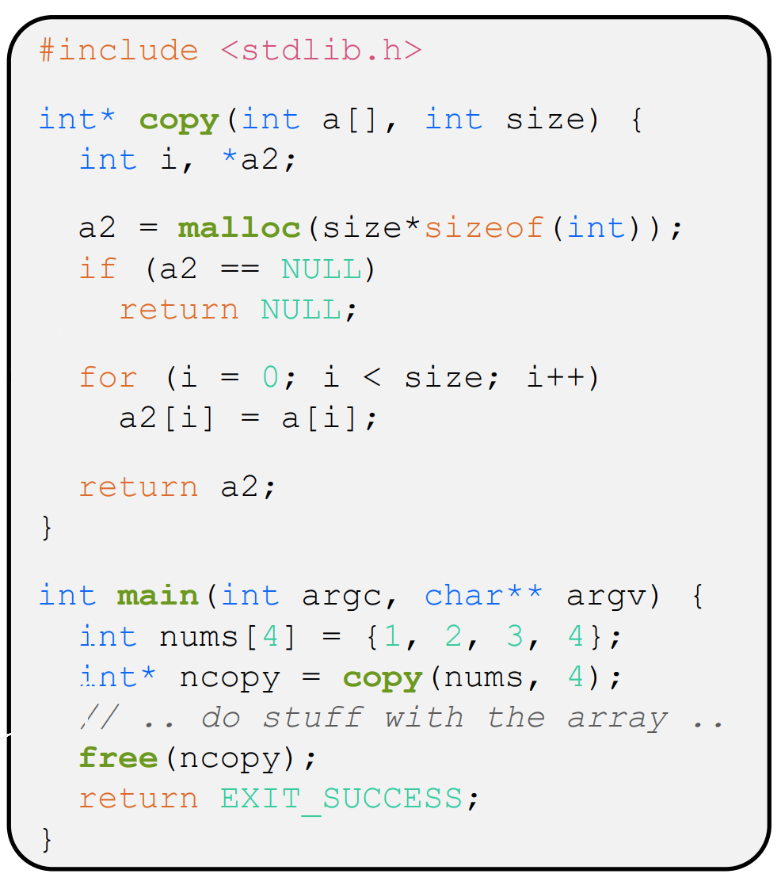
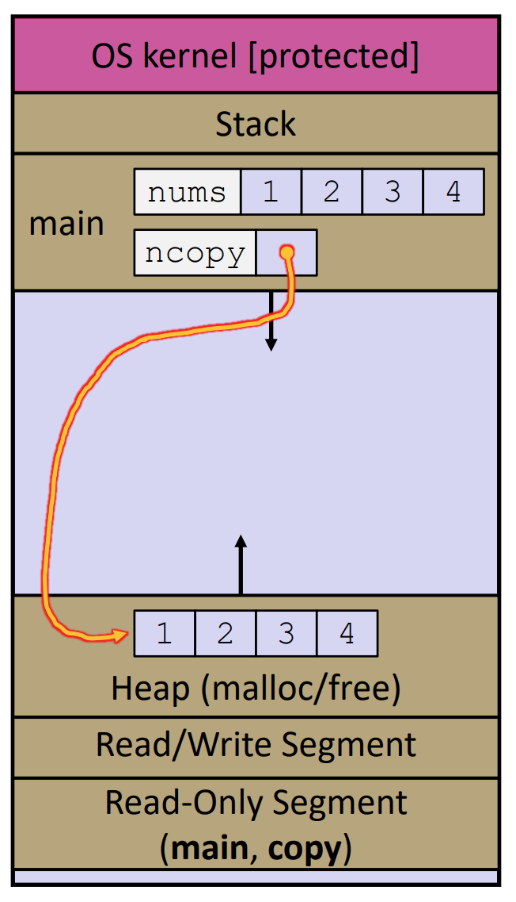

# Memory Management

Contributors: Tri Nguyen

## Introduction to Memory

When you remember something, how do you do it? You're probably thinking, "I just think about what I'm trying to remember". In reality, this question unconsiously sends signals to your brain to start scanning it. Therefore, your brain has to be:

1. Organized - Keep order in a logical way
2. Dynamic - Be flexible for new or deleted memories
3. Operational - Contain instructions to run tasks

Any coding language will have a memory structure that meets these requirements, and C/C++'s memory is a great way to learn how one of the world's earliest programing languages implemented these.

## Basic Memory Storage
The memory used to store anything is layed out as a grid of bytes, with each byte having a specific address, as shown below:


<div style="text-align: center"> Figure 1 - Basic Memory Layout </div>

Each word is the width of this grid, and it depends on each system, but generally, 64-bit systems will have 8 byte words since 8 bytes is 64 bits (Ah, now you know!) and 32-bit systems will have 4 byte words since 4 bytes is 32 bits. You'll also notice everything is represented in hexidecimal. In reality, it is binary, but its convienent to write it that way since everything will be two digits in hexdecimal as opposed to eight in binary.

As a basic concept, variable values can be stored on this grid. Do note that the address of variables is always the leftmost address of that variable. Take the following grid from a 32-bit, little endian system as an example:


<div style="text-align: center"> Figure 2 - Example Memory Layout with Values </div>

- `x` is a 4 byte variable that has the address 0x04, and a value of 0xF3290100 or 0d4079550720.
- `y` is a 4 byte variable with address 0x18 and a value of 0x00000001 or 1

Let's have fun with this grid a bit, since we have the opportunity. Notice how I never told you the type, so let's consider the possibilities (Let's assume that the table from [Primitive Data Types](primitive-data-types.md)):
- `x` and `y` are integers of decimal values 4079550720 and 1
- `x` is a `char` array (`char *` or `char[]`). Arrays are always continuous blocks of memory, so its entries are 0xF3 (`'ó'`), 0x29 (`')'`), 0x01 (`'SOH'`), and 0x00 (`'NUL'`), in that order.
- `y` is a `char` pointer (`char *`), pointing to a variable at 0x01, which is 0x00 (`'NUL'`)

---
Problem 1:
Consider the following code segment corresponding to Figure 2. Let us assume the `int` pointer `p` is established such that it occupies 0x10, that `y` is a `int` pointer, and that `x` is an `int`:

```C++
// x, y, and p have been initialized

p = (int *) ((char *)p - 16);
y =- 2;
x = *(y - 1);
```
What address does `p` and `y` point to, and what is the new value of `x`?

Answer:
- `p` is first reinterpreted as a `char`, so in pointer arithmatic, its address moves down 14 steps, so it is now pointing at address 0x10
- `y` is a `int` pointer, so its address moves down 2 * 4 = 8 steps, so it now points at 0x26
- `x` now contains the value `y` points at, offset by 1 `int` value (4 bytes), so the integer `x` is the integer at 0x22, read backwards, so `x` is 0x0000EFBE, or 0d61374
---
In a similar fashion, all other entities defined in your C++ program will be stored like so

## C/C++ Memory Structure
As you can imagine, putting enough of these blocks of memory together will yield a basis on which an entire program's memory can be located. However, it must be organized, and so in their wisdom, the founders of C came up with this setup:


<div style="text-align: center"> Figure 3 - C/C++ Memory Layout </div>

Let's break this down a bit to what each entity stores:
- Instructions - Source Code
- Literals - String Literals or Constants
- Static Data - Static and Global Variables
- Heap - Variables allocated by `new` or `malloc()`
- Stack - Variables and Information about functions

The next few sections will talk a little bit more about each of these sections in depth, but pay particular attention to how the Heap and Stack work.

## Code (Read-Only) Segment

Even with the new memories you gain throughout life, your brain always contains instructions to keep you alive, such as how to make your heat beat, how to breathe, and how to control your muscles. These instructions are contained in the brainstem. Likewise, the Instructions and Literals sections contain the "gears" necessary to run your program. 

However, you wouldn't want someone to come and damage your brain in a way that these vital instructions get LOST. So in C++, these sections are read-only, where once the compiler makes your program executable, these sections are unchangable, or rather immutable.

### Containing Function Definitions

The Instructions block contains the source code that is written out by your code, among other things needed to physically run your program. In particular, this contains all function and class definitions. This saves memory, since every time a function is called or a class is created, there is no need to copy everything. Having a place in memory where the computer knows how a function runs or what a class looks like saves some redundancy.

However, know you know that these entities, or any user-defined element, can be represented in memory, and if so, they must have memory addresses associated with them. We will talk about functions in this case. Let's say we have a function below:

```C++
int murry(int num1, int num2) {
    return num1 + num2;
}
```
<div style="text-align: center"> Figure 4a - Example Function </div>

It will have a memory address, obtainable by the "address of" operator (`&`). Of course, if we have its address, it must go into a pointer. Therefore, this means we can actually make variables that hold references to functions! This is achieved by the following syntax:

```C++
// returnType (*myPointerFunctionName)(argType1, argType2, ..., argTypeN) = &myFunctionName;

int (*murryHill)(int, int) = &murry;

// myPointerFunctionName(arg1, arg2, ..., argN);

std::cout << murryHill(1, 2); // Output: 3
```
<div style="text-align: center"> Figure 4b - Function Pointer and Use </div>

As you can see, the pointer can act as the function itself after its declaration and initialization. Of course, the pointer declaration's pointer type, as well as its parameters must match that of the function it is set to.

By this same syntax, you can reason that functions can be used as parameters. In reference to Figure 5, your formal parameter is the left hand side, while the actual parameter is the right hand side, as shown below:

```C++
/* Function with Function Parameter:

otherReturnType OtherFunction(returnType (*myPointerFunctionName)(argType1, argType2, ..., argTypeN), ...) {
    (...)
}

*/

// Calling that function:
// OtherFunction(&myFunction);

//murry() is already declared
int bell(int (*murryHill)(int, int), int num1, int num2, int num3) {
    return murrayHill(num1, num2) + num3;
}

int main() {
   int (*murryHill)(int, int) = &murry; 

   std::cout << bell(&murry, 1, 2, 3) << std::endl;
   std::cout << bell(murryHill, 4, 5, 6) << std::endl;
}
// Output:
// 6
// 15
```
<div style="text-align: center"> Figure 4c - Functions as Parameters </div>

Using it as a return type is more complicated and is not really done much, so it will not be covered here.

Starting C++11, you can use the class `std::function`, a class whose entire purpose is to hold a function, so you may find that less confusing (or more). In fact, LOST implements a class that is essentially like this for each of its stages.

### The Concept of Literals and Constants

The literals section will contain any large literals contained within the program. Literals are values that fall under the catagories of integers, floating point, character, or string values.

Constants are variables or definitions that associate any literal with a string literal, and are also contained in this section. There are two ways to define a constant:

1. Using the `const` qualifer: This is a qualifier, just like `static` or `private` that makes a variable read only. Its uses the following syntax:

<div style="text-align: center">

`const type varName;`

</div>

2. The second is to use the `#define` directive. This typically goes at the very top of your program, and its declaration is quite simple:

<div style="text-align: center">

`#define CONSTANT_NAME constantValue`

</div>

Either of these is fine, but in general, the `const` qualifier is used more for ensuring certain variables are never changed through its lifetime, while the `#define` directive is used more for defining a value used throughout the program.

## Initialized and Uninitialized Data

Regardless of what part of the world you came from, there will always be essential skills babies have to learn, such as walking, talking, and eating. Lots of these skills are contained in the cerebellum. In the same way, C/C++ sets aside memory it considers to be important for the lifetime of the program, and it places it under Static Data.

The name "Static Data" is a bit misleading as it also includes global, or external variables, which are variables that interact with the *translation units* of your program. These kinds of variable have their own storage space, and so it is reasonable to assume that these variables *persist* throughout the lifetime of the program. 

Some babies actually get some exposure to essential skills before birth through listening to their mothers. In fact, some babies have been reported to actually kick in rhythm to music a mother may be listening to or play. So, it can be said that their brains are being preloaded with this information. Likewise, when the program compiles, the static data section is broken up into initialized and uninitialized data. This will not be emphasized, but do keep this in mind.

### External and Internal Linkage of Variables

Any variable declared outside any control structure, or that uses the modifier `extern` is said to be **Externally Linked**. What this means is that it can be seen outside its own translation unit. Within memory, there is can only be one instance of that variable, and the same applies inside the code. Consider the following 2 file program made up of `helper.cpp` and `main.cpp`

```C++
#include <iostream>

// extern by default, so unneeded in reality
extern int sharedInteger;

void printSharedInteger() {
    sharedInteger++;
    std::cout << sharedInteger << " ";
}
```
<div style="text-align: center"> 

Figure 5a - `helper.cpp`

</div>

```C++
#include <iostream>

int sharedInteger = 1;

int main() {
    extern doubleSharedDouble = 0.0;
    std::cout << sharedInteger << " ";
    printSharedInteger();
    std::cout << ++sharedInteger << " ";
    printSharedInteger();
    std::cout << doubleSharedDouble;
    return 0;
}
```
<div style="text-align: center"> 

Figure 5b - `main.cpp`

</div>

1. When this program is compiled, one of the things C++ will do is look for what things are considered global, or external. The coder can help by specifying `extern`, but anything that is not contained within another control structure is automatically external. In this case, it is `sharedInteger`, as well as `main()` and `printSharedInteger()`.

2. You may be wondering why we have to declare `sharedInteger` in `helper.cpp`. You see, even though both variables and functions are external, only functions are truely "global" in the sense that it is automatically visible to every file. External variables must be redeclared in every file.

3. When `main()` runs, it uses a singular `sharedInteger` as we discussed earlier. `sharedInteger` is not different amongs the files, and each file modifies the same `sharedInteger`. Therefore, the output of this program is: 1 2 3 4

There are some problems you can get with the use of `extern` or rather its implicit use. For example, since there must only be 1 of any external entity, there can never be multiple versions of that entity. For example, the following modification to `main.cpp` produces a compiler, or rather linkage error.

```C++
#include <iostream>

int sharedInteger = 2; // Error: Cannot make 2 external variables with the same name, which would form a contradiction between sharedInteger in helper.cpp and shared integerInteger in main.cpp.

void printSharedInteger() {
    sharedInteger++;
    std::cout << sharedInteger << " ";
}
```
<div style="text-align: center"> 

Figure 5b - Erroneous `helper.cpp` 

</div>

You also cannot put `extern` variables inside of control structures, since that forms a contraction. Its scope would say it is visible within that control structure, but `extern` would say it is visible everywhere.

So, to combat such errors, you may think of using static variables. These variables are seen exclusively by their own translation unit, and as such, there can be multiple versions of them. Consider the following 2 file program made of `kern.cpp` and `brian.cpp`


```C++
#include <iostream>

static int localVar = 1;

int kernMain() {
    std::cout << localVar++ << ", ";
    return 0;
}
```
<div style="text-align: center"> 

Figure 6a - `kern.cpp` 

</div>

```C++
#include <iostream>

static int localVar = 100;

int main() {
    kernMain();
    std::cout << ++localVar << ", ";
    kernMain();
    std::cout << ++localVar;
    return 0;
}
```
<div style="text-align: center"> 

Figure 6a - `brian.cpp` 

</div>

1. Unlike `extern`, `static` must be specified for something to be considered local to a translation unit. 

2. The placement of static variables in memory is such that you can support multiple static variables of the same name, so static entities can all have the same name.

3. Since the use of `static` confines `localVar` to each translation unit, each translation unit uses a different `localVar`. Therefore, the output of this program is: 1, 101, 2, 102

However, because of its setup, `static` variables will never be shared by multiple translation units, but as you can see, they bypass the fact that we can't declare multiple `extern` variables with the same name.

You can even place them inside of control structures too. (This implies that you cannot have 2 or more static variables in the same scope). However, this interaction is more about the persistence of these variables. Consider the following modification to `kern.cpp`

```C++
#include <iostream>

int kernMain() {
    static int localVar = 1;
    std::cout << localVar++ << ", ";
    return 0;
}
```
<div style="text-align: center"> 

Figure 6a - `brian.cpp` 

</div>

What do you think will happen when we run `main()`? Its tempting to think this will function as any other variable now, that we will get the output: 1, 101, 2, 102. However, we know better than that! We know that `static` or `extern` variables are *persistent*. So this variable doesn't get redeclared everytime. What actually happens is that the preprocessor will declare all these variables at compilation. Therefore, whenever we update `localVar` from `kern.cpp`, it really will continue incrementing it by one, and the output is the same as last time: 1, 101, 2, 102. The only difference here is that the scope of `localVar` in `kern.cpp` is limited to `kernMain()` now.

This entire discussion on `extern` v. `static` can be summarized into a table, which also applies to both function and class member definitions.

Table 1: `extern` v. `static`
Trait|`extern`|`static`
---|---|---
Visibility|Global|Local
Memory Locations|Exactly One|At Least One
Containable?|No|Yes

## The Heap

All of us have memories we cherish. Whether it is something like playing with friends or getting a cool present, most of these memories get stored in the hippocampus, which is in the cerebrum. In C/C++, that would be the heap. It is a unique area in the memory where the coder can choose to send memory here, and is exclusively for variables.

We also have memories we need to remember, such as knowledge for an upcoming test. To cultivate such memories, we need to do things like study. The heap also comes with similar responsibilities. Just as you are the librarian of your brain, your code must keep the heap in good shape and up to date.

Finally, there are some memories we wish to forget. For example, when you accidently scream in front of your entire class. In C/C++, you can actually do this with heap memory, and it is as vital that you do this when needed.

We need to note a few things before we begin. The evolution of heap memory management has changed with the transition from C to C++. To manage the heap's memory by C, you must always include `malloc.h`, or the package containing it, `stdlib.h`. C++ has eliminated the use of this through special syntax, but you will often have to use C-style memory management anyway, so both will be taught.

### Allocating Memory

The heap has several advantages:
- Since heap memory exists for as long as we want it to, we can use it to store variables that we need across many scopes and functions.
- As you will later find, allowing the computer to automatically store very large local variables does not always work due to size limitations within the Stack.

To reserve memory within the heap, C will use the function:

<div style="text-align: center">

`void* malloc(size_t size);`

</div>

- Parameter: Accepts the size of the amount of memory you want to allocate in bits (It looks like an integer).
- Return: A void pointer, which if you recall, can be cast into any type of pointer. 
- Use: Typically assigned to a pointer that holds that address.

Typically, to specify `size`, the method `size_t sizeof(type)` is used in conjuction with it, which returns the size of `type` in bits. If you want to create a pointer of type `type`, then you can use the following syntax:

<div style="text-align: center">

`type* pointerName = (type *) (malloc(sizeof(type)));`

</div>

If you wanted to make an array of size N, a simple modification can be done:

<div style="text-align: center">

`type* pointerName = (type *) (malloc(sizeof(type) * N));`

</div>

or you can use the overloaded function

<div style="text-align: center">

`type* pointerName = (type *) (malloc((size_t) N, sizeof(type)));`

</div>

**Note:** This only declares the variable, you must initialize the variable in a seperate step. Also, in C, `sizeof()` does not return a `size_t`, so you would have to cast it, along with N.

C++ has an equivalent. You can use the `new` keyword in conjunction with a constructor, just like in Java. However, this works on anything in C++, including primative types. It looks like this:

<div style="text-align: center">

`new Type(arg1, arg2, ..., argN);`

</div>

- Parameter: Corresponds to the parameter of the constructor for Type. For primitive and advanced variables, you may leave it blank or use the desired value corresponding to Type.
- Return: A Type pointer, or Type*.
- Use: Typically assigned to a pointer that holds that address.

The assignment is the same as in Java, except the recieving variable MUST be a pointer, just like in C

<div style="text-align: center">

`Type* pointerName = new Type(arg1, arg2, ..., argN);`

</div>

The C++ style of doing this has several advantages:

- Strongly Typed: The return of the C++ statement is more type-safe than the C counter part, as it explicitly labels the pointer as a specific type.
- Automatic Memory Calcuation: You do not need to actually specify how big of a memory size you want.
- Faster Initialization: The use of the constructor allows for declaration and initialization all in 1 step.

However, the need for any of these stem from the fact that C/C++ lack a complete garbage collector, with C lacking any concept of it at all. A garbage collector is a system that automatically manages a system's memory. In particular, both systems lack a system that resets destroyed variables, which involves the resetting of the corresponding memory to its null, or zero value.

A use of C++ style allocation can avoid this by providing initialization values in the constructor, but this cannot be done in many cases. So, what happens in most cases is that when `malloc()` or `new` is used, the resulting pointer points to memory containing the value of the previous variable that used that memory. 

This presents an issue in many contexts, for example, when you need to make a counter variable. Fortunately, there are many solutions, one of which is to just set the variable to its zero or null value before use. The easiest, however, is to use:

<div style="text-align: center">

 `void* calloc(size_t size);` 
 
 or 
 
 `void* calloc(size_t N, size_t size);`

</div>

This is the same as `malloc()`, except it resets the value of the memory it allocates before returning it. As you can tell, this originates from C and not C++.

Say you also want to change the size of a variable that has previously been allocated. You must then use:

<div style="text-align: center">

`void* realloc(void *ptr, size_t new_size);`

</div>

This is the same as `malloc()` except it will allocate the same memory pointed to by `ptr` and more. It typically gets reassigned to `ptr`. 

However, you should not use this if you can. `realloc()` is a function that is not designed very well and can produce unexpected behavior (Go ahead and search it up if you don't believe me). Its typically better if you can just do a `malloc()`/`calloc()` and `free()` combination if possible.

These are all valid ways to allocate memory to the heap, and note that as Figure 3 points out, the heap grows upward the more memory we put into it, hence the name "heap".

### Deallocating Memory

This MUST always happen after you are done with whatever you allocated. In C, this is achieved with:

<div style="text-align: center">

`void free(void *ptr);`

</div>

In C++, this is achieved using `delete`:

<div style="text-align: center">

`delete ptr;`

</div>

However, if it is an array, then we use `delete[]`, which is very important because using normal `delete` on an array will only deallocate the first entry:

<div style="text-align: center">

`delete[] ptr;`

</div>

If objects are properly made, you will never need to delete an object since when they fall out of scope, they will be deleted. However, there is more to them concerning memory management than meets the eye. See the section on Classes for more information.

It is tempting, but do not mix and match the C and C++ versions of allocation/deallocation. This means do not do something like `malloc()` a pointer and then `delete` it, or `new Type()` a pointer and then `free()` it. Since they are from different versions of C/C++, this can produce unexpected behavior.

### Memory Management Errors

---
Problem 2:

Consider the following code:

```C++
#include <stdlib.h>
#include <iostream>

int FunctionFirst(int size) {
    int* arrayFirst = (int *) calloc(sizeof(int) * size);
    arrayFirst[0] = 1;
    for(int i = 1; i < size; i++) {
        arrayFirst[i] += 1 + arrayFirst[i - 1];
    }
    return arrayFirst[size - 1];
}

double* FunctionSecond(int size, double value) {
    double* arraySecond = (double *) malloc(sizeof(double) * size);
    for(int i = 0; i < size; i++) {
        arraySecond[i] = value;
    }
    return arraySecond;
}

int main() {
    std::cout << "Sum from 1 to 400 as an integer: " << FunctionFirst(400);
    double* same = FunctionSecond(500, 40.0);
    std::cout << "Repeated value: " << same[0];
    free(same);
    return 0;
}
```

Assume that the heap only has 5000 bytes. What is the output of this program?

Answer: An error occurs. Note how `FunctionFirst()` never uses `free()` or `delete` on `arrayFirst`. This means that after exiting `FunctionFirst()`, we can no longer use the memory occupied by `arrayFirst` since it still technically exists, which is 400 * 4 = 1600 bytes. Note that `arraySecond` gets `delete`d through the pointer `same`, but that is assuming the code gets to that point. `arraySecond` occupies 500 * 8 = 4000 bytes, so considering all memory sources in the heap, that is 4000 + 1600 = 5600 bytes. This is over the limit of this code, so when `arraySecond` is allocated, we will get an error stating there is not enough memory.

Solution 1: Return `arrayFirst` and then delete its alias.

Solution 2: save `arrayFirst[size - 1]` into a variable, delete `arrayFirst` and return that variable.

Solution 3: Tell Linux/OS to reserve more memory next time.

---

Problem 2 shows an example of a **memory leak**. It occured when when `arrayFirst` was not deallocated, but note that it wasn't an actual error. That is because the code assumes it is still in use.

---
Problem 3:

Below is a modifed version of the code from Problem 2. What's wrong with it?

```C++
#include <stdlib.h>
#include <iostream>

int* FunctionFirst(int size) {
    int* arrayFirst = new int[size];
    arrayFirst[0] = 1;
    for(int i = 1; i < size; i++) {
        arrayFirst[i] += 1 + arrayFirst[i - 1];
    }
    return arrayFirst;
}

int* FunctionSecond(int *arr, int size) {
    int* arraySecond = arr;
    for(int i = 0; i < size; i++) {
        arraySecond[i] += 1;
    }
    return arraySecond;
}

int main() {
    int* sameFirst = FunctionFirst(400);
    double* sameSecond = FunctionSecond(sameFirst, 400);
    std::cout << "Sum from 1 to 400 as a Double plus 1: " << (double) sameSecond(sameSecond[399]);
    delete[] sameFirst;
    delete[] sameSecond;
    return 0;
}
```

Answer: Note the relationship between `sameFirst` and `sameSecond`. They are physically the same block of memory. It is allocated into `arrayFirst`, modifed inside of `FunctionFirst()`, returned into `sameFirst`, then fed into `FunctionSecond()` as `arraySecond`, modified, and returned as `sameSecond`. The reason this is a problem is that `sameFirst` and `sameSecond` are deleted, but they refer to the same block of memory, which means the code attempts to delete the array twice, and this is the error.

Solution 1: Delete either `sameFirst` or `sameSecond`, just not both.

Solution 2: In `FunctionSecond()`, instead equating `arr` and `arraySecond`, initialize `arraySecond` properly with `malloc` or something else, and in the for loop, set each element to one more than the corresponding element in `arr`.

Solution 3: Just don't even make a `sameSecond` or `FunctionSecond()` and go straight to the answer.

---

The error in Problem 2 is known as a **double free** and can occur if you aren't being careful about what memory is which.

---
Problem 4:

Below is a modifed version of the code from Problem 3. What is wrong with it?

```C++
#include <stdlib.h>
#include <iostream>

int* FunctionFirst(int size) {
    int* arrayFirst = (int *) calloc(sizeof(int) * size);
    arrayFirst[0] = 1;
    for(int i = 1; i < size; i++) {
        arrayFirst[i] += 1 + arrayFirst[i - 1];
    }
    return arrayFirst;
}

double* FunctionSecond(int* arr, int size) {
    double* arraySecond = (double *) arr
    for(int i = 0; i < size; i++) {
        arraySecond[i] += 1.0;
    }
    return arraySecond;
}

int main() {
    int* sameFirst = FunctionFirst(400);
    double* sameSecond = FunctionSecond(sameFirst, 400);
    std::cout << "Sum from 1 to 400 as a Double plus 1: " << (double) sameSecond(sameSecond[399]);
    free(sameFirst);
    return 0;
}
```

Answer: Note the cast in done to produce `arraySecond`. Casting in a language that lacks type-safety is risky, but it is fatal in this example. A cast from an int to double array reinterprets the array as as one with blocks of 8 bytes, so `arraySecond` has not 400 ints, but 200 doubles! When the for loop in `FunctionSecond` triggers, it will access an element out of bounds and will cause an error.

Solution 1: Iterate through `arr` and assign it to an already initialized `arraySecond` that has 400 * 8 = 3200 bits. 

Solution 2: Use a valid casting operator, found in the STL library. Just as long as its not std::reinterpret_cast<T*>, please.

Solution 3: Just don't, this is a bad thing to do in general.

---

This is an error so special to C++ that you don't see it in other languages. This is called a **Segmentation Fault**, and occurs because the program attempted to reach memory it wasn't allowed to reach.

## The Stack

Let's take one of those essential skills we discussed earlier, walking. On some days, someone might want to walk with you in the forest, or in the rain. Your brain remembers these attributes in your cerebrum and executes the action of walking, stored in your cerebellum/brainstem, with those modifications.

Just like so, C/C++ executes functions using the *Stack*, which stores variables that modify a fundamental task, or function stored in *Instructions*, which may rely on anything inside of *Static Data*. 

If you have a list of actions to do, you're going to remember and execute them one by one. In the same way, the *Stack* uses "frames", which represent each function call that has occured. Of course, when your done with the action, your going to "forget it" and move on to the next, which is what the *Stack* does with its frames as well.

### The Organization of Stack Frames

When a method is called, it will create a frame on the stack, which is just another chunk of memory. The frame is shown as the following:


<div style="text-align: center"> 

Figure 7 - An Individual Stack Frame

</div>

On first glance, we have the stack pointer, which is always present and will point to the end of the stack, or rather the top since these stacks are upside-down. As Figure 3 suggests, the stack grows downward, and so that is why the top of the stack is at the "bottom". Besides the stack pointer, we also have the following:

- Caller Frame: This is optional, and among other things will hold arguments if the number of arguments for a function call
- Return Address: This section holds the address of the variable to be returned
- Old Frame Pointer: This is an address to the end of the previous frame.
- Saved Registers and Local Variables: This is where all variables used by the function will be located
- Argument Build Area: If the function corresponding to the current frame will call another function, this area is dedicated to holding the parameters for that function.

The first thing to note is the amount of memory space the stack has. As the structure suggests, there is not a whole lot of room to store any parameters or local variables, so the heap can be used in conjunction with the stack to hold those values at times. 

Second, the frame will store even more things, but in all honesty, what concerns us is the fact that they hold parameters and local variables of each method call. So, its more useful if we think of it more like this:


<div style="text-align: center"> 

Figure 8a - Stack Frames in Practicallity

</div>

where `main()` and `copy()` are methods with parameters and local variables `nums`, `ncopy`, `a`, `size`, `i`, and `a2`. You can see that it is the stack that holds these variables, and they are contained in their appropriate frame. You can already tell that `copy()` was called from `main()` since it is lower on the stack. You can see the definitions here:


<div style="text-align: center"> 

Figure 8b - Code Corresponding to Figure 8a

</div>

Can you figure out what line we are at based on Figure 8a? Since i exists and is at value 4, we are within the for loop on its last iteration.

Once `copy()` is done executing, you can imagine that it will dissapear from the stack, and it does. After the line `int* ncopy = copy(nums, 4);` is done executing, the stack pointer will roll back and the stack effectively now looks like this:


<div style="text-align: center"> 

Figure 8c - Reduced Frames due to Function Completion

</div>

Because C/C++ lacks a garbage collector, the frame for `copy()` is still physically there, it simply is just not used anymore.

If you haven't noticed yet, this is why we call it a stack! We can "push" the memories of function calls onto the stack, and we can "pop" it off once we're done.

### Collision Between the Heap and Stack

As you have seen by now, the stack and frame grow towards each other, so what happens if they collide? Well, let's talk first about how this can happen. We can have:

1. Too many frames - This comes from having too many nested function calls, a common occurance in recursion.
2. Too much allocated Memory - This comes from using `malloc()` or `new` too many times
3. A bit of both

These are all examples of what is called Stack-Heap Collision, but not all are errors:

1. The overflow of frames into the heap is what you probably have heard of as **Stack Overflow**. This is an error and halts the program.
2. The overflow of the heap into the stack never occurs. This is because `malloc()` or `new` will return `NULL` if you attempt to do this, meaning there simply is no more memory. You will probably get an error anyway, as when you attempt to dereference the pointer, it will give a null pointer error.
3. On a high-level, it would seem that they both grow into each other, but the stack and heap can only grow one at a time, so one of the first two will happen first.

## In Conclusion

Memory management for C/C++ is a complicated topic, bolstered by the fact that you must manually manage memory. It may be frustrating to do this, along with being able to do C/C++ properly, you will have a stronger understanding of operating systems in general. Also, you just got a psychology lesson too, so that's a bonus!