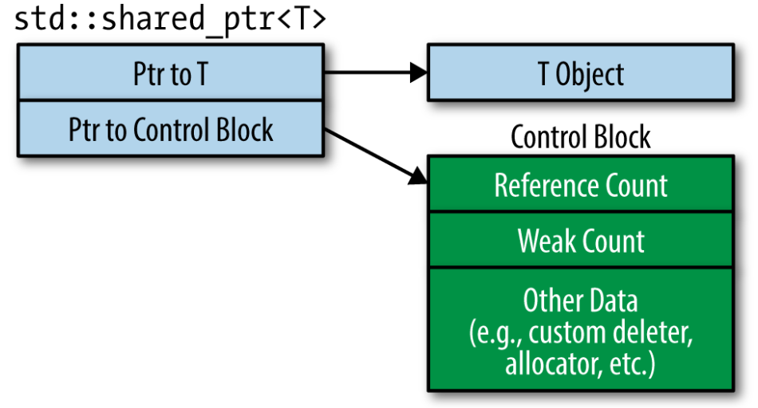

# Smart Pointers, Part 2

Contributors: Edward Zhang

---
## `std::shared_ptr`

Let's look at shared pointers!

These are similar to unique pointers, but now we allow objects to be shared / "owned" by multiple shared pointers

---
## Reference counting

If multiple shared pointers can own an object, how do we know when to `delete` the pointed-to object?

Quite intuitively, we use the notion of **reference counting**. For each object, we keep a count of how many shared pointers are pointing to it
> NOTE: this section provides some nice intuition for reference counts. However, keep reading to see how complications can arise because of the actual implementation

The reference count for an object is adjusted like so:
- When we make a new  shared pointer to the object, increment its reference count by 1
- When a shared pointer to it is destroyed, decrement reference count by 1

Note that shared pointers can be copied
- I.e., its copy constructor and copy-assignment operators are defined
- Copy-assignment can also increment or decrement reference counts (see next section)

Finally, when a shared pointer sees that the object's reference count is 0, destroy the pointed-to object

---
## Creating shared pointers

Example 1:
```C++
int main(){
  int *p = new int(333); // pointing to an int object
  std::shared_ptr<int> x(p);
  // Now reference count to int object is 1

  // y also shares ownership of int object,
  // reference count = 2
  std::shared_ptr<int> y(x);

  // y now falls out of scope and is destroyed
  // ref count for int object is 2-1 = 1

  // x now falls out of scope and is destroyed, ref count = 0
  // Since ref count = 0, delete int object

  // Again, no memory leaks!
}
```

Example 2: copy-assignment
```C++
int main(){
  // p points to an int object, let's call the object "P"
  int *p = new int(333);
  std::shared_ptr<int> x(p); // ref count for P = 1

  int *q = new int(124); // q points to another int object, "Q"
  std::shared_ptr<int> y(q); // ref count for Q = 1

  std::shared_ptr<int> z(x); // ref count for P = 2
  x = y;
  // x now goes off to share ownership of "Q", abandoning "P"

  // What are the ref counts?
  // Answer: ref count for P = 2-1 = 1, ref count for Q = 1+1 = 2

}
```

Earlier I said that "for each object, we keep a count of how many shared pointers are pointing to it." So Example 3 should work just fine right?

Example 3: bug bug bug
```C++
int main(){
  // p points to an int object, let's call it "P"
  int *p = new int(333);
  std::shared_ptr<int> x(p); // shared pointer #1 to P
  std::shared_ptr<int> y(p); // shared pointer #2 to P

  // So what is the reference count for P?
  // You'd expect 2 right?
  // Right?
  // ...
}
```

Actually no, running Example 3 causes a runtime error (double free)

Why? Let's see the next section for how reference counts are implemented. Long story short, in Example 3 we create two DIFFERENT reference counts for object `P`, resulting in a double free

---
## Implementing reference counts

As an exercise, think about how you would implement reference counts
- Hint: conceptually the reference count is associated with the object being pointed to, but is this feasible to implement?

Simplified answer: each shared pointer keeps track of its pointed-to object's reference count

Real answer: each `std::shared_ptr` object contains a pointer to a data structure called the **control block**

The control block stores a reference count for the object the shared pointer is pointing to, among other things
- The control block can also contain a copy of some custom deleter and something called a weak count (not covered here)

Here's a nice visual:



---
## Control block creation

The key thing is to understand when a control block is actually created

Rules for control block creation:
1. `std::make_shared` (which we will cover later) ALWAYS creates a control block. This makes sense since `make_shared` creates a new object to point to
2. When the `std::shared_ptr` constructor is called with a RAW POINTER, it creates a new control block
3. Calling a `std::shared_ptr`'s copy constructor does NOT create a new control block, just increments the existing control block's reference count by 1

---
## `shared_ptr` double free bug, revisited

Control block creation rule #2 in the last section tells us why our earlier [Example 3](#creating-shared-pointers) failed

Example 3: double free bug
```C++
int main(){
  // p points to an int object, let's call it "P"
  int *p = new int(333);
  std::shared_ptr<int> x(p);
  std::shared_ptr<int> y(p);

  // double free!
}
```
- First, `x` has a field pointing to a new control block with reference count = 0 for `P`
- Then, since we create `y` by passing in a raw pointer to its constructor, `y` has a field pointing to a new control block, also with reference count = 0 for `P`
- We have multiple reference counts!
- When `y` falls out of scope, we decrement its reference count for `P` to 0. Since reference count = 0, destroy `P`
- Then when `x` falls out of scope and its reference count for `P` falls to 0, we try to destroy `P` again - double free!!


> In practice, avoid creating `std::shared_ptr`s from variables of raw pointer type

---
## Some extra notes on `shared_ptr`

Before C++17, shared pointers did NOT support wrapping arrays, which meant you had to provide a custom deleter. As of C++17, you can safely do things like:
```C++
std::shared_ptr<int[]> x(new int[10]);
```

<br>

As you may have realized, `shared_ptr` has more overhead than raw pointers or `unique_ptr`, typically twice as big
- Try to use `unique_ptr` unless you truly need shared management


<br>

Increment and decrement of the reference count must be atomic
- This must be the case, otherwise threading will cause problems

---
## Be careful!

Be careful when working with shared pointers, there are quite a few ways to inadvertently give yourself a headache

What is wrong with the following example?
```C++
int main(){
  int* x = new int(333);
  {
    // Temporary inner scope
    std::shared_ptr<int> y(x);
  }
  std::cout << *x << std::endl; // What does this print?
}
```
Answer:
- You might expect `333` to be printed
- Actually no, we expect undefined behavior here

<br>

I'll write out the example again with comments explaining why

```C++
int main(){
  // x is pointing to some int object "X"
  int* x = new int(333);
  {
    // Temporary inner scope

    // Ok, y has field pointing to control block
    // with reference count for X = 1
    std::shared_ptr<int> y(x);

    // End of block, y falls out of scope
    // y's reference count for X is 0
    // So destroy X!
  }
  std::cout << *x << std::endl;
  // Whoops, we're trying to access freed memory...
}
```

---
See the [next chapter](./smart-pointers-3.md) for one last issue surrounding `shared_ptr`s